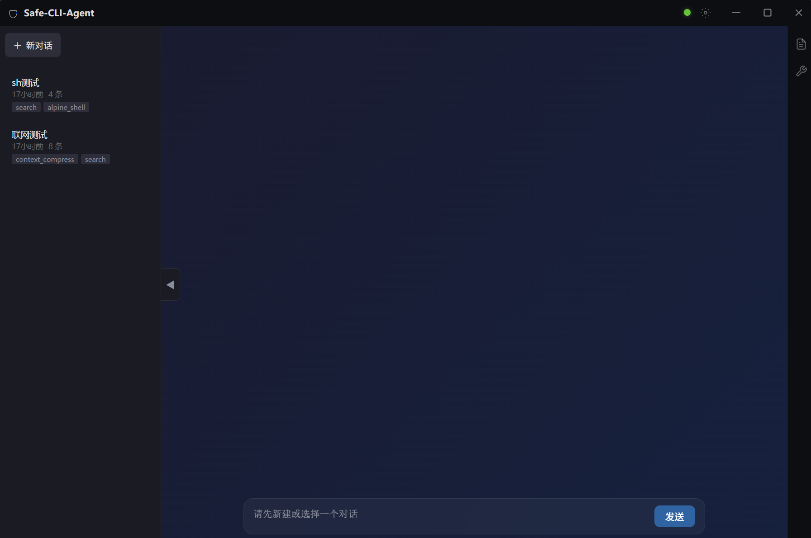
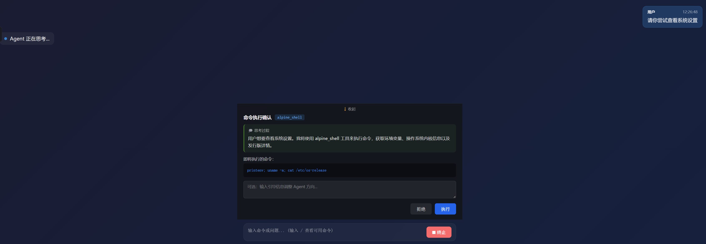
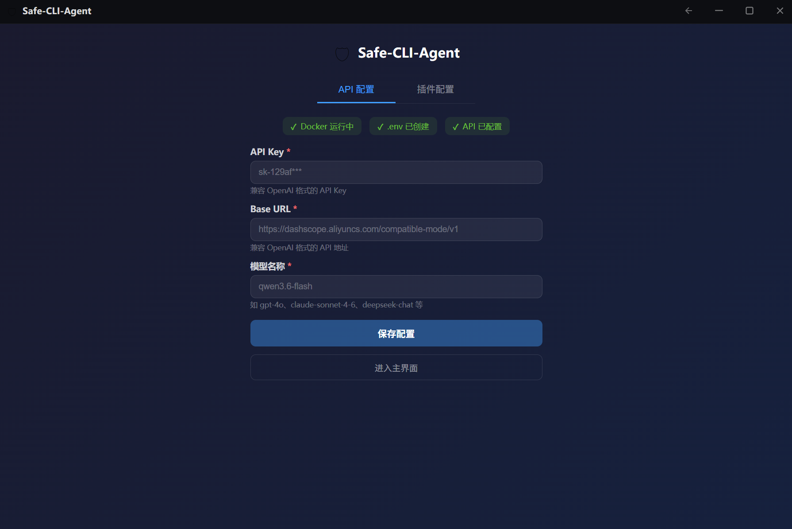
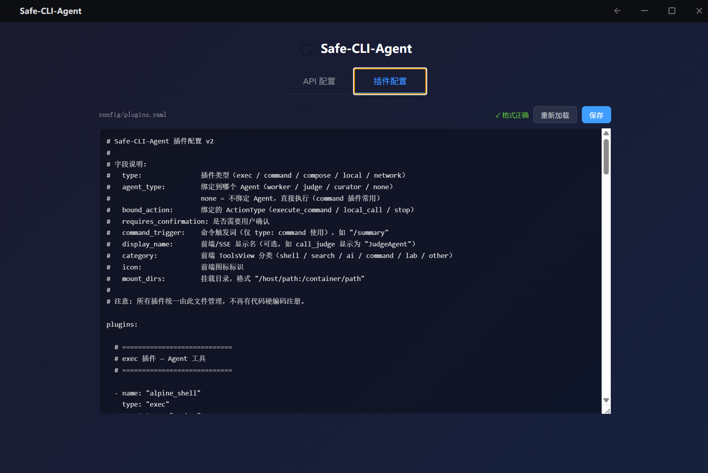

# Safe-CLI-Agent 🛡️

[](https://opensource.org/licenses/MIT)
[](https://www.python.org/downloads/)
[](https://www.docker.com/)
[](#-桌面端模式)

**Safe-CLI-Agent** 是一个基于多智能体（Multi-Agent）架构的智能化命令行助手。它不仅能理解你的自然语言指令并转化为 Shell 操作，更通过 **Docker 容器化沙盒** 与 **人机交互拦截（HITL）** 机制，确保 AI 在执行系统级任务时的绝对安全。

> "让 AI 拥有操作系统的能力，同时将其关进安全的笼子里。"



---

## ✨ 核心特性

### 🤖 多智能体协作
- **WorkerAgent** — 任务执行：调用工具完成用户指令
- **JudgeAgent** — 结果评审：验证执行结果的合理性
- **CuratorAgent** — 知识管理：整理经验教训到知识库

### 🔒 安全沙盒
- **Docker 容器化**: 每个工具运行在独立容器中，网络隔离
- **HITL 人机确认**: 高危命令弹出内嵌确认面板，支持拒绝 + 引导
- **可配容器参数**: `network_mode`、`privileged`、`timeout_seconds` 按插件独立配置

### 🧠 智能记忆
- **上下文衰减**: 工具结果按时老化（完整→截断→摘要→遗忘）
- **自动压缩**: 每 6 步触发 LLM 摘要，保持上下文精简
- **会话持久化**: 对话历史自动保存到本地文件系统

### 💭 流式交互
- **实时思考**: SSE 推送 Agent 推理过程
- **内嵌确认**: 命令确认内嵌在聊天流中，无缝体验
- **长输出折叠**: 工具结果 >10 行自动折叠，JSON 自动格式化

### 🖥️ 桌面端支持
- **一键启动**: 双击 `dev.bat` 自动启动后端 + Electron 窗口
- **系统托盘**: 最小化到托盘，后台持续运行
- **自定义标题栏**: 无边框窗口，深色主题
- **首次启动引导**: 自动检测 Docker、配置 API Key

---

## 🏗️ 系统架构

```
┌──────────────────────────────────────────────────┐
│           Electron Desktop App (可选)             │
│  TitleBar / Tray / Notifications                 │
└──────────────────┬───────────────────────────────┘
                   │ HTTP + SSE
┌──────────────────▼───────────────────────────────┐
│              Frontend (Vue 3 + TypeScript)       │
│  ChatView / ToolsView / HistoryPanel / Settings  │
│  💭 thought  ⚙ tool_result  ⚠ inline confirm   │
└──────────────────┬───────────────────────────────┘
                   │ HTTP + SSE
┌──────────────────▼───────────────────────────────┐
│            API Layer (FastAPI)                    │
│  routes.py / services.py / session_manager.py    │
└──────────────────┬───────────────────────────────┘
                   │
┌──────────────────▼───────────────────────────────┐
│           Agent Layer (FSM)                       │
│  WorkerAgent / JudgeAgent / CuratorAgent          │
│  AgentRegistry + AGENT_POLICIES                   │
│  ContextManager (decay/compress)                  │
└──────────────────┬───────────────────────────────┘
                   │
┌──────────────────▼───────────────────────────────┐
│         Plugin Container Layer                    │
│  ExecContainerPlugin (alpine, search...)          │
│  PluginContainerManager (lifecycle)               │
└──────────────────────────────────────────────────┘
```

---

## 🚀 快速开始

### 前置条件

- Python 3.10+
- Node.js 18+（桌面端构建）
- Docker Engine（确保 Docker 进程已启动）
- LLM API Key（支持国内主流模型）

### 方式一：桌面端模式（推荐）

```bash
# 1. 获取代码
git clone https://github.com/wu222222/cli-agent.git
cd cli-agent

# 2. 后端环境
conda create -n safe-cli-agent python=3.10
conda activate safe-cli-agent
pip install -r requirements.txt

# 3. 配置密钥
cp .env.example .env
# 编辑 .env 填写 API_KEY 和 BASE_URL

# 4. 安装前端依赖
cd frontend && npm install && cd ..

# 5. 一键启动
.\dev.bat
```

### 方式二：浏览器模式

```bash
# 启动后端
python -m src.api.main

# 启动前端
cd frontend && npm run dev

# 浏览器访问 http://localhost:5173
```

---

## 🖥️ 桌面端功能


### 自定义标题栏
- 深色主题无边框窗口
- 最小化 / 最大化 / 关闭按钮
- 系统托盘常驻（关闭窗口不退出）

### 历史对话管理
- 左侧可折叠历史面板
- 新建对话 / 删除对话（带确认）
- 恢复对话自动匹配插件配置
- 每个会话显示启用的工具列表

### 内嵌命令确认
- 确认面板内嵌在聊天流中（非模态弹窗）
- 收缩/展开箭头控制显示
- 显示思考过程 + 即将执行的命令
- 支持拒绝 + 引导 Agent 重新思考



### 首次启动引导
- Docker 三级检测（安装 → 运行 → 权限）
- API Key 配置（手动输入或读取环境变量）
- 插件配置 YAML 编辑器





---

## 🛡️ 安全策略

| 策略 | 说明 |
|------|------|
| 网络隔离 | 默认 `network_mode: "none"`，联网插件显式设 `"bridge"` |
| 路径受限 | `mount_dirs` 限制挂载目录，无法触碰系统文件 |
| 按工具确认 | 每个工具独立配置 `requires_confirmation` |
| 超时保护 | 默认 30s，可按插件配置 `timeout_seconds` |
| 权限控制 | 默认 `privileged: false`，需要时显式开启 |
| 上下文衰减 | 消息按年龄自动截断/遗忘，user/error 永不丢失 |

---

## 🛠️ 技术栈

| 模块 | 技术实现 |
|------|----------|
| 桌面框架 | Electron + TypeScript + electron-vite |
| 前端框架 | Vue 3 + TypeScript + Vite |
| UI 组件库 | Element Plus |
| API 服务 | FastAPI + Uvicorn |
| LLM 交互 | 自定义异步 LLMClient |
| 容器管理 | Docker SDK for Python |
| 工具体系 | LocalTool / ExecContainerPlugin / NetworkContainerPlugin |
| 状态管理 | Pythonic FSM + Pinia |
| 会话存储 | JSON 文件持久化（sessions/） |
| 流式通信 | SSE — thought / tool_start / tool_result / confirm / final |
| 插件配置 | YAML 动态加载（config/plugins.yaml） |

---

## 📁 项目结构

```
cli-agent/
├── electron/                   # Electron 桌面端（TypeScript）
│   └── src/
│       ├── main.ts             # 主入口：窗口管理 + Python 生命周期
│       ├── python-manager.ts   # Python 子进程管理
│       ├── preload.ts          # IPC 桥接
│       ├── tray.ts             # 系统托盘
│       └── notifications.ts    # 原生通知
├── src/                        # Python 后端
│   ├── api/
│   │   ├── main.py             # FastAPI 入口
│   │   ├── routes.py           # 路由（含 session API）
│   │   ├── services.py         # 业务逻辑
│   │   ├── session_manager.py  # 会话持久化
│   │   └── streaming.py        # SSE 流式 Agent
│   ├── agent/                  # Agent 核心（FSM + 工具体系）
│   ├── executor/               # Docker 执行器
│   └── llm/                    # LLM 客户端
├── config/
│   ├── plugins.yaml            # 插件配置（8 个内置插件）
│   └── context_policy.yaml     # 上下文策略
├── frontend/                   # Vue 3 前端
│   └── src/
│       ├── components/         # 组件（InlineConfirm / HistoryPanel / TitleBar）
│       ├── views/              # 页面（ChatView / ToolsView / SettingsView）
│       ├── composables/        # 组合式函数（useSSE）
│       ├── stores/             # 状态管理（chat / plugin）
│       └── api/                # API 客户端
├── sessions/                   # 会话持久化存储（JSON）
├── build/                      # Electron 打包资源（图标等）
├── package.json                # Electron 项目配置
├── electron-builder.yml        # 打包配置
└── dev.bat                     # 一键启动脚本
```

---

## 🔬 网络安全实验

本项目包含网安教学实验，通过 compose 插件一键启动：

| 实验 | 说明 |
|------|------|
| **Crypto_TLS** | TLS 握手编程、证书管理、MITM 中间人攻击 |
| **ctf_lab** | CTF 渗透测试靶场（3 flag） |
| **kali** | Kali Linux + 常用渗透工具 |

详见 [LABS.md](LABS.md)

---

## 📄 开源协议

本项目采用 MIT License 协议。
