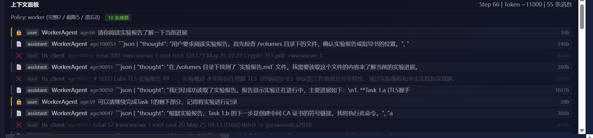

# Safe-CLI-Agent 🛡️

[](https://opensource.org/licenses/MIT)
[](https://www.python.org/downloads/)
[](https://www.docker.com/)

**Safe-CLI-Agent** 是一个基于多智能体（Multi-Agent）架构的智能化命令行助手。它不仅能理解你的自然语言指令并转化为 Shell 操作，更通过 **Docker 容器化沙盒** 与 **人机交互拦截（HITL）** 机制，确保 AI 在执行系统级任务时的绝对安全。

> "让 AI 拥有操作系统的能力，同时将其关进安全的笼子里。"


---

## ✨ 核心特性

- 🤖 **多智能体协作 (Multi-Agent)**: Worker（任务执行）+ Judge（结果评审）+ Curator（知识管理）
- 🔒 **配置驱动插件**: 新增插件只需编辑 `plugins.yaml`（9 个内置插件），不改代码。支持 exec / command / compose / local / network 五种类型。
- ⚙️ **确定性状态机 (FSM)**: 基于状态机管理 Agent 行为，THINKING→WAITING_CONFIRMATION→EXECUTING→COMPLETED。
- 🛡️ **按工具安全拦截**: 每个工具独立配置 `requires_confirmation`，弹出确认对话框展示工具名、思考过程和命令。
- 💭 **实时流式展示**: SSE 推送 thought（思考）、tool_start、tool_result（长输出自动折叠）、confirm（含工具名）、final。
- 📊 **上下文可视化**: 上下文面板实时显示消息衰减状态（完整/截断/摘要/遗忘），一键清空。
- 🧠 **智能记忆衰减**: 工具结果按时老化：完整→截断→一行摘要→删除。每 6 步自动 LLM 压缩。user/error 消息永不遗忘。
- 🔧 **可配容器参数**: `network_mode`（none/bridge）、`privileged`、`timeout_seconds` 按插件独立配置。

---

## 🏗️ 系统架构

系统采用分层设计，确保推理逻辑与执行环境解耦：

```
┌─────────────────────────────────────────────┐
│              Frontend (Vue 3)               │
│  ChatView / ToolsView / HistoryView         │
│  💭 thought  ⚙ tool_result  ⚠ confirm      │
└──────────────────┬──────────────────────────┘
                   │ HTTP + SSE
┌──────────────────▼──────────────────────────┐
│            API Layer (FastAPI)              │
│  routes.py / services.py / streaming.py     │
└──────────────────┬──────────────────────────┘
                   │
┌──────────────────▼──────────────────────────┐
│           Agent Layer (FSM)                 │
│  WorkerAgent / JudgeAgent / CuratorAgent    │
│  AgentRegistry + AGENT_POLICIES             │
│  ContextManager (decay/compress)            │
└──────────────────┬──────────────────────────┘
                   │
┌──────────────────▼──────────────────────────┐
│         Plugin Container Layer              │
│  ExecContainerPlugin (mylab, alpine...)     │
│  PluginContainerManager (lifecycle)         │
└─────────────────────────────────────────────┘
```

1. **前端层**: Vue 3 + TypeScript，提供聊天交互（thought/tool_result 气泡）、工具设置（启停容器）、历史记录。
2. **API 层**: FastAPI，处理 HTTP 请求、SSE 流式推送（6 种事件类型）、组件管理。
3. **推理层**: 支持 Function Calling 的大模型（如 Qwen, GPT-4 等）。
4. **控制层**: 维护状态流转、上下文管理、人机确认拦截、Agent thought 存储。
5. **执行层**: 插件化 Docker 容器，按需启动/停止，支持挂载目录配置。

---

## 🚀 快速开始

### 前置条件

- Python 3.10+
- Node.js 18+ (前端构建)
- Docker Engine (确保 Docker 进程已启动)
- LLM API Key (支持国内主流模型)

### 1. 获取代码

```bash
git clone https://github.com/wu222222/cli-agent.git
cd cli-agent
```

### 2. 后端环境配置 (推荐使用 conda/mamba)

```bash
mamba env create -f environment.yml
mamba activate safe-cli-agent
# 或者使用 pip
# pip install -r requirements.txt
```

### 3. 配置密钥

```bash
cp .env.example .env
# 编辑 .env 文件，填写你的 API_KEY 和 BASE_URL
```

### 4. 启动后端

```bash
python -m src.api.main
# 后端运行在 http://localhost:8000
```

### 5. 启动前端

```bash
cd frontend
npm install
npm run dev
# 前端运行在 http://localhost:5173
```

### 6. 访问应用

打开浏览器访问 `http://localhost:5173`，进入聊天界面。点击"工具设置"可配置可用工具和启动容器。

> 📖 新增插件详见 [plugin-guide.md](plugin-guide.md)

---

## 🖥️ 前端功能


### 工具设置页面 (`/tools`)


工具管理页面，支持：
- **工具勾选**: 为 WorkerAgent 配置可用工具列表（如 call_judge + mylab）
- **容器启停**: 每个 exec 工具显示容器状态（运行中/已停止），支持一键启动/停止
- **保存即生效**: 保存配置时自动启动已勾选的 exec 容器
- **挂载路径显示**: 展示每个工具的 mount_dirs 配置

### 命令确认页面 (`/confirm`)


命令确认页面，支持：
- **确认执行**: 确认执行待执行命令
- **拒绝执行**: 拒绝执行待执行命令，后端自动清理挂起的 Agent 状态
- **引导agent**: 用户键入信息，引导 Agent 执行任务

### 聊天交互页面 (`/`)



主聊天界面支持：
- **自然语言输入**: 输入任意问题或指令，Agent 会自动分析并执行
- **💭 思考气泡**: Agent 推理过程实时展示
- **⚙ 工具结果气泡**: 命令参数截断显示，长输出自动折叠（>10 行），JSON 自动格式化
- **🔒 命令确认**: 弹出确认对话框展示工具名、思考过程和命令，支持拒绝+引导
- **📊 上下文面板**: 实时显示每条消息的衰减阶段（🔒完整/✂️截断/📝摘要/❌遗忘）
- **⌨ 命令提示**: 输入 `/` 自动匹配可用的 command 插件
- **🗑 清空上下文**: 一键清空对话历史和上下文

---

## 🛡️ 安全策略 (Security)

- **网络隔离**: 默认 `network_mode: "none"`，需要联网的插件（如 kali）显式设 `"bridge"`。
- **路径受限**: 通过 `mount_dirs` 配置挂载目录，Agent 无法触碰宿主机系统文件。
- **按工具确认**: 每个工具独立配置 `requires_confirmation`，拒绝后可通过引导让 Agent 重新思考。
- **超时保护**: 默认 30s，可按插件配置 `timeout_seconds`。docker exec + streaming 双层超时。
- **权限控制**: 默认 `privileged: false`，nmap 等需要的工具显式开启。
- **上下文衰减**: 消息按年龄自动截断/遗忘，user 和 error 永不丢失。

---

## 🛠️ 技术栈 (Technical Stack)

| 模块 | 技术实现 |
|------|----------|
| 前端框架 | Vue 3 + TypeScript + Vite |
| UI 组件库 | Element Plus |
| API 服务 | FastAPI + Uvicorn |
| LLM 交互 | 自定义异步 LLMClient |
| 容器管理 | Docker SDK for Python（PluginContainerManager） |
| 工具体系 | 三层架构（LocalTool / ExecContainerPlugin / NetworkContainerPlugin） |
| 状态管理 | Pythonic Finite State Machine (FSM) |
| 数据校验 | Pydantic V2 |
| 流式通信 | Server-Sent Events (SSE) — thought / tool_start / tool_result / confirm / final |
| 插件配置 | YAML 动态加载（config/plugins.yaml） |

---

## 📁 项目结构

```
cli-agent/
├── src/
│   ├── api/                  # FastAPI 后端
│   │   ├── main.py           # App 入口
│   │   ├── models.py         # 请求/响应模型
│   │   ├── routes.py         # 路由处理器（chat/plugins/agent/tools/reject）
│   │   ├── services.py       # 业务逻辑、组件初始化
│   │   └── streaming.py      # SSE 流式 Agent（emit_thought/tool_start/tool_result）
│   ├── agent/                # Agent 核心逻辑
│   │   ├── agent.py          # Worker/Judge/Curator Agent
│   │   ├── base.py           # Agent 基类（含 last_thought）
│   │   ├── statemachine.py   # 状态机实现
│   │   ├── context.py        # 上下文管理
│   │   ├── prompt.py         # Prompt 管理（动态工具文档生成）
│   │   ├── tools.py          # 工具体系（Tool/LocalTool/ExecContainerPlugin/ToolRegistry）
│   │   └── types.py          # 类型定义
│   ├── executor/             # Docker 执行器
│   │   ├── docker.py         # DockerExecutor + PluginContainerManager
│   │   └── client.py         # DockerClientFactory
│   └── llm/                  # LLM 客户端
├── config/
│   ├── plugins.yaml          # 插件配置 v2（9 个插件）
│   └── context_policy.yaml   # Agent 上下文策略
├── frontend/                 # Vue 3 前端
│   ├── src/
│   │   ├── views/            # 页面（ChatView 含上下文面板 / ToolsView）
│   │   ├── composables/      # 组合式函数（useSSE）
│   │   ├── stores/           # 状态管理（chat / plugin）
│   │   ├── api/              # API 客户端（agent / config）
│   │   └── types/            # TypeScript 类型
│   └── package.json
├── knowledge_base/           # 知识库目录
├── workspace/                # 工作目录（alpine_shell 默认挂载）
└── environment.yml           # Conda 环境配置
```

---

## 📄 开源协议

本项目采用 MIT License 协议。
